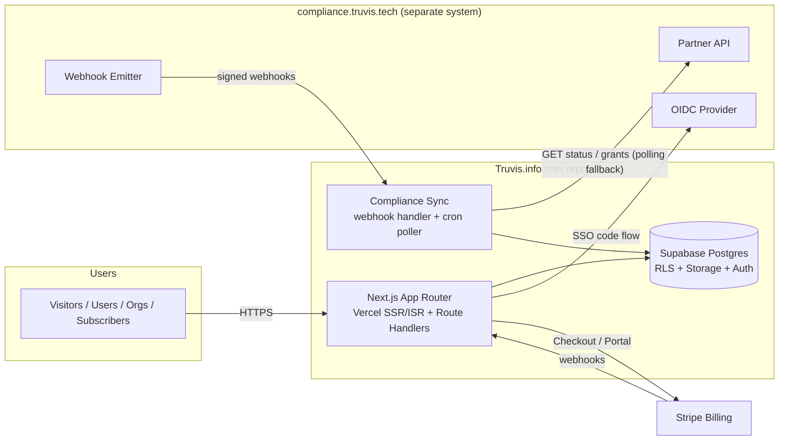
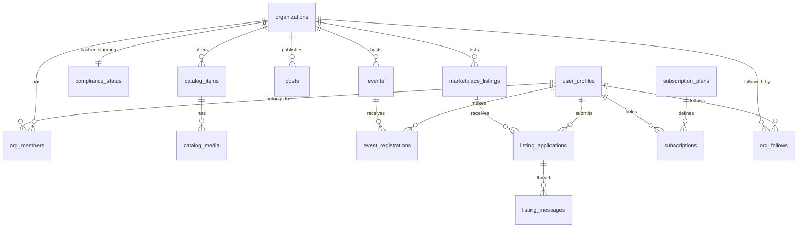

# Architecture & Integration Contract

**Product:** Truvis.info · **Version:** 1.0 (Draft) · **Date:** 2026-07-19
**Related docs:** [BRD.md](./BRD.md) · [PRD.md](./PRD.md) · [DEVELOPMENT_PLAN.md](./DEVELOPMENT_PLAN.md)

---

## 1. System Overview

Truvis.info and compliance.truvis.tech are **separate systems** with their own databases. compliance.truvis.tech is the system of record for organization identity, vault documents, and compliance standing; Truvis.info consumes a narrow, well-defined API surface from it and caches only what it needs to render and gate content.



**Stack:** Next.js 16 (App Router, TypeScript, Tailwind) on Vercel · Supabase (Postgres, Auth, Storage, RLS) · Stripe Billing · Resend (or equivalent) for transactional email.

Key principles:

1. **Narrow replication.** Truvis.info stores compliance data only as a *cache for visibility decisions and profile rendering* — never vault documents.
2. **Fail-safe visibility.** If sync breaks, orgs hide (stale > 72h ⇒ hidden), never the reverse.
3. **RLS everywhere.** Public reads go through views that already embed the visibility rule; there is no code path that can leak a hidden org.
4. **Mock-first integration.** A mock compliance service implements the exact contract below so product development never blocks on the compliance team (PRD CMP-7).

---

## 2. Application Structure

```
app/
  (public)/            # SEO surface, SSR/ISR
    page.tsx           # landing
    directory/         # browse + search (DIR-4/5)
    orgs/[slug]/       # profile, catalog items (DIR-1, CAT-3)
    events/            # index + [slug] (EVT-2)
    marketplace/       # teaser index + [slug] teaser (MKT-2)
    feed/              # aggregate posts (POST-2)
  (dashboard)/
    dashboard/         # org + user + subscriber dashboards (DSH-1..3)
  admin/               # platform admin (DSH-4, ADM-*)
  api/
    webhooks/compliance/   # signed webhook intake (CMP-2)
    webhooks/stripe/       # entitlement sync (SUB-2)
    cron/compliance-poll/  # polling fallback (Vercel Cron)
components/            # ui/ (shadcn-style primitives) + feature components
lib/
  supabase/            # server/client/admin Supabase clients
  compliance/          # API client + types + mock (contract §5)
  billing/             # Stripe helpers + entitlement checks
  visibility.ts        # THE single visibility derivation (CMP-3)
types/                 # shared domain types
supabase/
  migrations/          # SQL migrations (source of truth for schema)
```

Rendering strategy: public pages = ISR with tag-based revalidation (`revalidateTag('org:<id>')` fired by sync/state changes); dashboards = dynamic SSR with Supabase session; admin = dynamic SSR behind admin role.

---

## 3. Data Model



Table inventory (full DDL in [`supabase/migrations/0001_initial_schema.sql`](../supabase/migrations/0001_initial_schema.sql)):

| Table | Purpose | Notes |
|---|---|---|
| `user_profiles` | 1:1 with `auth.users`; display name, avatar, compliance-SSO subject id | |
| `organizations` | Org registry: slug, verified fields (from grant), marketing fields, `grant_active`, `admin_suspended`, derived `is_visible` | `is_visible` maintained by trigger; public reads filter on it |
| `org_members` | membership: role (`owner/admin/member`) + permission scopes | |
| `compliance_status` | cache: `state, risk_level, score, renewal_expiry, synced_at`, raw payload | 1:1 org; written only by sync (service role) |
| `catalog_items`, `catalog_media` | products/services + media refs (Storage paths) | |
| `posts` | rich-text body (JSON), status, published_at | |
| `events` | event fields incl. `approval_mode`, capacity, status | |
| `event_registrations` | status: `pending/approved/rejected/waitlisted/cancelled`; unique (event,user) | |
| `marketplace_listings` | type: `fundraise/equity_sale/business_sale`; teaser fields vs. detail fields separated; status | detail columns readable only via approved-application RLS path |
| `listing_applications` | status: `pending/approved/rejected/withdrawn`; confidentiality acceptance timestamp | |
| `listing_messages` | thread messages per application | |
| `subscription_plans`, `subscriptions` | plan catalog + entitlement state synced from Stripe | gating reads `subscriptions.status IN ('active','trialing','past_due<grace')` |
| `org_follows` | user follows org | |
| `audit_log` | append-only; actor, action, entity, reason, payload | insert-only policy; no update/delete |

**Visibility rule** (implemented once, in SQL + mirrored in `lib/visibility.ts`):

```
is_visible = grant_active
         AND NOT admin_suspended
         AND compliance_status.state = 'compliant'
         AND compliance_status.risk_level <> 'high'
         AND compliance_status.score >= score_threshold
         AND (renewal_expiry IS NULL OR renewal_expiry > now())
         AND compliance_status.synced_at > now() - interval '72 hours'
```

---

## 4. Security Model

- **RLS deny-by-default** on all tables. Public access exclusively through policies that embed `is_visible` (e.g., `organizations_public_read` requires `is_visible = true`).
- **Marketplace detail**: `marketplace_listings` detail columns and `listing_messages` accessible to (a) the listing org's members, (b) users with an `approved` application **and** active subscription, (c) admins.
- **Storage buckets**: `public-media` (logos, catalog images — public CDN) vs `listing-docs` (private; time-limited signed URLs generated server-side only for entitled viewers).
- **Service-role usage** confined to server: webhook handlers, cron poller, admin server actions.
- **Webhooks**: HMAC-SHA256 signature verification (shared secret per environment), timestamp tolerance ±5 min, idempotency by `event_id`.
- **Admin**: `platform_admin` flag in `user_profiles` set only via database migration/manual op; admin routes double-check server-side.
- **Rate limiting** (Vercel middleware + Upstash or Supabase): auth endpoints, search, application submission.

---

## 5. Compliance Platform Integration Contract

> This section is the deliverable to hand to the compliance.truvis.tech team. Truvis.info ships a mock implementing exactly this contract (`lib/compliance/mock.ts`), so the contract — not the implementation timeline — is the coupling point.

### 5.1 SSO (OIDC)

- compliance.truvis.tech acts as an **OIDC provider** (authorization code + PKCE).
- Scopes: `openid profile email truvis.grants:read`.
- ID token claims: `sub` (stable compliance user id), `email`, `name`, `org_ids` (compliance orgs the user can represent).
- Truvis.info registers as a client; redirect URI `https://truvis.info/auth/callback/compliance` (+ staging/dev equivalents).
- Supabase Auth consumes it as a custom OIDC provider; the `sub` is stored on `user_profiles.compliance_subject`.

### 5.2 REST API (server-to-server)

Base URL: `https://api.compliance.truvis.tech/partner/v1` · Auth: `Authorization: Bearer <API key>` (per-environment keys, IP allowlist optional). All responses JSON, UTF-8.

#### `GET /orgs/{complianceOrgId}/publication-grant`

Returns the current Truvis.info publication grant, or 404 if none/revoked.

```json
{
  "grant_id": "grt_9f2c",
  "org_id": "org_a1b2",
  "status": "active",              // active | revoked
  "granted_at": "2026-07-01T08:00:00Z",
  "authorized_fields": ["legal_name", "trade_license_no", "jurisdiction",
                         "incorporation_year", "industry_code", "size_band",
                         "contact_person"],
  "profile": {
    "legal_name": "Example Logistics LLC",
    "trade_license_no": "CN-1234567",
    "jurisdiction": "AE-DU",
    "incorporation_year": 2015,
    "industry_code": "H.52",
    "size_band": "51-200",
    "contact_person": {
      "name": "Omar A.",
      "title": "Managing Director",
      "email": "omar@example.com",
      "phone": "+9715xxxxxxx",
      "consent_recorded_at": "2026-07-01T08:00:00Z"
    }
  }
}
```

Only fields present in `authorized_fields` are included in `profile`. `contact_person.consent_recorded_at` is required for PDPL traceability (PRD Q5 assumes consent captured grant-side).

#### `GET /orgs/{complianceOrgId}/standing`

```json
{
  "org_id": "org_a1b2",
  "state": "compliant",            // compliant | non_compliant | under_review | lapsed
  "risk_level": "low",             // low | medium | high
  "score": 82,                      // 0-100
  "renewal_expiry": "2027-03-31",
  "checked_at": "2026-07-19T06:00:00Z"
}
```

#### `GET /orgs?updated_since={iso8601}&cursor=…`

Bulk/paged listing of orgs whose grant or standing changed — used by the polling fallback and nightly reconciliation.

### 5.3 Webhooks (compliance → Truvis.info)

Endpoint: `POST https://truvis.info/api/webhooks/compliance`
Headers: `X-Truvis-Signature: t=<unix>,v1=<hmac_sha256(t + "." + body)>`, `X-Truvis-Event-Id` (idempotency key).

| Event | Payload | Truvis.info reaction |
|---|---|---|
| `grant.activated` | grant object (§5.2) | Enable claim; upsert verified fields; recompute visibility |
| `grant.updated` | grant object | Refresh verified fields (e.g., contact person changed) |
| `grant.revoked` | `{grant_id, org_id, revoked_at}` | Unpublish immediately (BR-6) |
| `standing.changed` | standing object | Update cache; recompute visibility; audit-log transition |

Delivery: at-least-once; retries with exponential backoff for non-2xx up to 24h. Truvis.info must be idempotent on `event_id`.

### 5.4 Resilience rules

- **Primary:** webhooks. **Fallback:** cron poll of `GET /orgs?updated_since` every 30 min. **Reconciliation:** nightly full sweep.
- Any org whose `compliance_status.synced_at` exceeds **72h** is auto-hidden (BR-5) and surfaced on the admin sync-health panel.
- Contract versioning via URL (`/partner/v1`); additive changes only within a version.

### 5.5 Environments

| Env | Truvis.info | Compliance API | Notes |
|---|---|---|---|
| dev | localhost / Vercel preview | **mock service in-repo** | mock supports scripted scenarios (flag org, lapse, revoke) |
| staging | staging.truvis.info | compliance staging (when available) | contract conformance tests run here |
| prod | truvis.info | api.compliance.truvis.tech | keys via Vercel env vars |

---

## 6. Billing Integration (Stripe)

- Products/Prices defined in Stripe: `buyer_pro_monthly`, `buyer_pro_annual`.
- Checkout Session (mode=subscription) started server-side; success/cancel URLs on `/dashboard/billing`.
- Webhooks consumed: `checkout.session.completed`, `customer.subscription.updated|deleted`, `invoice.payment_failed` → upsert `subscriptions` row (entitlement source of truth, PRD SUB-2).
- Customer portal for self-serve management. UAE VAT: collect TRN on business subscribers (SUB-4).

## 7. Observability & Ops

- Vercel Analytics + structured server logs; Sentry for error tracking (both apps’ DSNs env-scoped).
- Health signals on admin dashboard: last compliance webhook time, orgs stale >24h (warning) / >72h (hidden), Stripe webhook failures.
- Alerts (email/Slack): webhook silence > 6h, poll failures, error-rate spikes.
- Backups: Supabase PITR; weekly logical dump to cold storage.

## 8. Architecture Decision Records (initial)

| # | Decision | Rationale |
|---|---|---|
| ADR-1 | Next.js + Supabase + Vercel monolith (no separate API service) | Team size, speed to market, RLS gives defense-in-depth; revisit if compliance-side traffic patterns demand |
| ADR-2 | Separate DBs + API contract with compliance platform | User decision; independent scaling/release cadence; narrow PII replication |
| ADR-3 | Visibility as derived column maintained by trigger + recompute on sync | One source of truth queryable in RLS policies; avoids scattering rule logic |
| ADR-4 | Mock-first compliance client behind an interface | Unblocks all phases before the partner API exists (risk R3) |
| ADR-5 | Stripe despite regional alternatives | Fastest subscription stack (Checkout/Portal/webhooks); platform fees only — deal money never flows through us |
